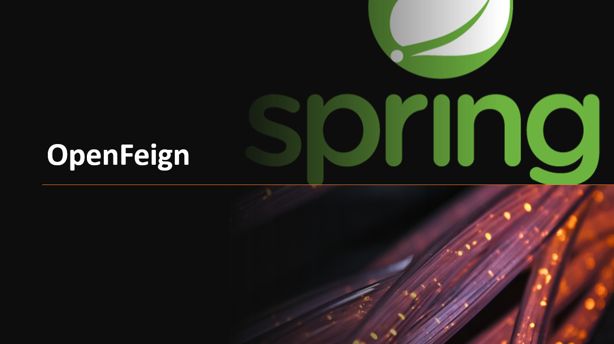

## Support & Feedback 
Este projeto é mantido por Eduardo Nofre. Por favor, entenda que não poderemos fornecer suporte individual por e-mail. Acredito também que a ajuda é muito mais valiosa se for partilhada publicamente, para que mais pessoas possam beneficiar dela.

# Exemplo de utilização do Spring OpenFeign e RestTemplate

## O que Spring OpenFeign?
Em resumo, o OpenFeign é uma biblioteca de clientes HTTP que permite que os desenvolvedores escrevam código de maneira mais declarativa e simplifica a comunicação com serviços externos em Java. Se você está trabalhando em um projeto que precisa consumir APIs RESTful, o OpenFeign pode ser uma excelente opção para simplificar o código e reduzir a complexidade.

## Aqui temos exemplo duas API o Client e o consomeClient:
### *Client* disponibiliza os endpoints para o *consomeClient*
 - *Client*, esse client retorna algumas handle Exception:
    - status: 204 no content -Observação OpenFeign parece não capturar ou  utilizar 404 not found.
    - status: 409 utlizado e definido para regra de negocio.
    - status: 200 ok em caso de sucesso.
    - status: 201 ok em caso de sucesso inserção de dados no banco.
    - Os endpoint estão mapeado no properties do Client
### *ConsomeClient* este consome as informaçoes *Client* 
 - *O ConsomeClient* tambem esta tratando Exception de erro em tempo de execução:
   - status: 500 INTERNAL_SERVER_ERROR
   - status: 405 METHOD_NOT_ALLOWED
   - status: 404 NOT_FOUND
     
###  Ainda temos essa API java-OpenFeign-exemplo.
  - Essa Api é um exemplo simples utilizando VIA cep como exemplo.
  - Os endpoint estão mapeado no yaml do java-OpenFeign-exemplo

